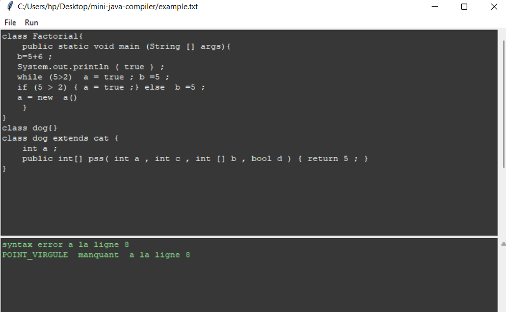

# Mini Java Compiler
### Run the syntax generator
flex minijava.lex  
bison -d minijava.y  
gcc -o miniJava minijava.tab.c lex.yy.x  
miniJava.exe < ../example.exe  
### Run the application
python main.py

