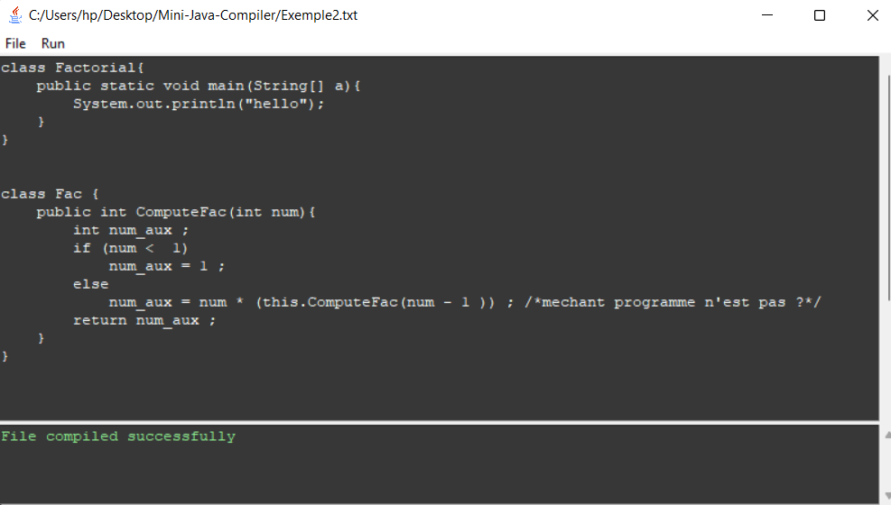

# Mini Java Compiler
### Run the syntax generator
```
cd syntax
flex minijava.lex 
bison -d minijava.y 
gcc -o miniJava minijava.tab.c lex.yy.c
miniJava.exe < ../example.txt
```
### Run the application
```
python main.py
```


